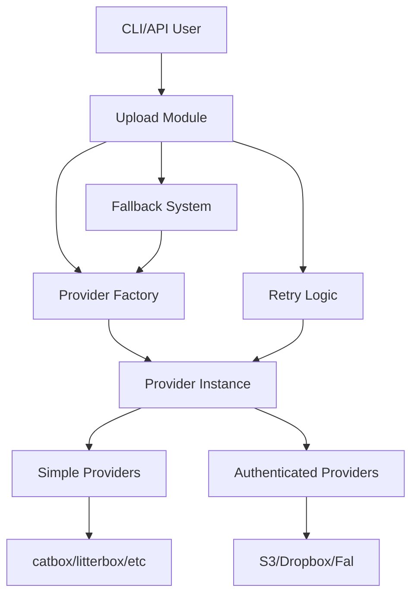
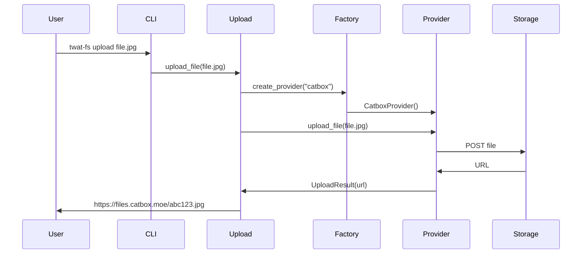
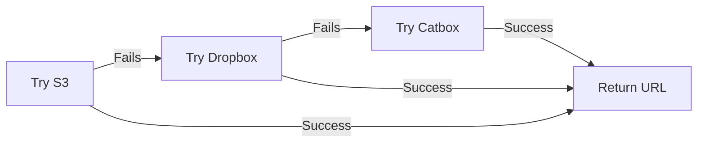

# System Architecture

This document describes the architecture of twat-fs, its design decisions, and how components interact.

## Overview

twat-fs follows a modular, provider-based architecture designed for:

- **Extensibility**: Easy to add new storage providers
- **Reliability**: Automatic retry and fallback mechanisms
- **Flexibility**: Support for both sync and async operations
- **Simplicity**: Clean API for users and developers



## Core Components

### 1. Upload Module (`upload.py`)

The main orchestrator that handles:

- **Provider Selection**: Determines which provider(s) to use
- **Retry Logic**: Handles transient failures with exponential backoff
- **Fallback Management**: Tries alternative providers on failure
- **Timing and Metrics**: Tracks upload performance
- **Options Management**: Processes user preferences

Key classes:
```python
@dataclass
class UploadOptions:
    remote_path: str | Path | None = None
    unique: bool = False
    force: bool = False
    upload_path: str | None = None
    fragile: bool = False

@dataclass
class ProviderInfo:
    success: bool
    explanation: str
    help_info: dict[str, str]
    timing: dict[str, float] | None = None
```

### 2. Provider System

#### Provider Factory (`factory.py`)

Responsible for:
- **Discovery**: Finding available provider modules
- **Instantiation**: Creating provider instances
- **Validation**: Checking provider readiness

```python
class ProviderFactory:
    @staticmethod
    def get_provider_module(provider_name: str) -> Provider | None:
        """Dynamically import and return provider module."""
        
    @staticmethod
    def create_provider(provider_name: str) -> ProviderClient | None:
        """Create an instance of the provider client."""
```

#### Provider Protocol (`protocols.py`)

Defines the interface all providers must implement:

```python
@runtime_checkable
class ProviderClient(Protocol):
    """Protocol that all provider clients must implement."""
    
    def upload_file(
        self,
        local_path: str | Path,
        remote_path: str | Path | None = None,
        *,
        unique: bool = False,
        force: bool = False,
        upload_path: str | None = None,
        **kwargs: Any,
    ) -> UploadResult:
        """Upload a file and return its URL."""
        ...
```

#### Base Providers (`simple.py`)

Abstract base classes that provide common functionality:

- **BaseProvider**: Core upload logic and file validation
- **AsyncBaseProvider**: For providers with async implementations
- **SyncBaseProvider**: For providers with sync implementations

### 3. Error Handling

#### Error Hierarchy

```python
class ProviderError(Exception):
    """Base exception for provider errors."""
    def __init__(self, message: str, provider: str):
        self.provider = provider
        super().__init__(message)

class RetryableError(ProviderError):
    """Temporary errors that should be retried."""
    # Network timeouts, rate limits, etc.

class NonRetryableError(ProviderError):
    """Permanent errors that shouldn't be retried."""
    # Auth failures, file too large, etc.
```

#### Retry Strategy

The `@with_retry` decorator implements intelligent retry logic:

```python
@with_retry(
    max_attempts=2,
    strategy=RetryStrategy.EXPONENTIAL,
    exceptions=(RetryableError,)
)
def upload_file(...):
    # Automatic retry on RetryableError
```

### 4. Async Support (`async_utils.py`)

Utilities for bridging async and sync code:

- **`@to_sync`**: Convert async functions to sync
- **`@to_async`**: Convert sync functions to async
- **`gather_with_concurrency`**: Limited concurrent execution
- **`run_async`**: Run async code in sync context

### 5. CLI Interface (`cli.py`)

Built with Python Fire for automatic CLI generation:

```python
class TwatFS:
    """Main CLI interface for twat-fs."""
    
    def upload(self, file_path: str, ...):
        """Upload command implementation."""
    
    def upload_provider(self):
        """Provider management commands."""
        return ProviderManager()
```

## Provider Implementation

### Simple Provider Example

```python
class CatboxProvider(SimpleProvider):
    """Provider for catbox.moe uploads."""
    
    provider_name = "catbox"
    base_url = "https://catbox.moe/user/api.php"
    
    def upload_file_impl(self, file: BinaryIO) -> UploadResult:
        response = requests.post(
            self.base_url,
            data={"reqtype": "fileupload"},
            files={"fileToUpload": file}
        )
        return UploadResult(url=response.text.strip())
```

### Authenticated Provider Example

```python
class S3Provider(BaseProvider):
    """AWS S3 upload provider."""
    
    def __init__(self, bucket: str, region: str, credentials: dict):
        self.client = boto3.client('s3', **credentials)
        self.bucket = bucket
    
    def upload_file_impl(self, file: BinaryIO) -> UploadResult:
        key = self._generate_key(file.name)
        self.client.upload_fileobj(file, self.bucket, key)
        url = f"https://{self.bucket}.s3.{region}.amazonaws.com/{key}"
        return UploadResult(url=url)
```

## Data Flow

### Upload Sequence

1. **User Request**: CLI/API receives upload request
2. **File Validation**: Check file exists and is readable
3. **Provider Selection**: Determine which provider(s) to use
4. **Provider Creation**: Factory creates provider instance
5. **Upload Attempt**: Provider uploads file
6. **URL Validation**: Verify uploaded file is accessible
7. **Retry/Fallback**: On failure, retry or try next provider
8. **Return URL**: Return successful upload URL



### Fallback Flow



## Design Patterns

### 1. Factory Pattern

Used for provider instantiation to:
- Decouple provider creation from usage
- Enable dynamic provider loading
- Centralize provider management

### 2. Strategy Pattern

Providers implement a common interface but with different strategies:
- Simple providers: Direct HTTP upload
- S3: AWS SDK with multipart
- Dropbox: OAuth2 with chunked upload

### 3. Decorator Pattern

Decorators add functionality to methods:
- `@with_retry`: Adds retry logic
- `@with_timing`: Adds performance metrics
- `@with_url_validation`: Validates upload success

### 4. Protocol Pattern

Type-safe interfaces using Python protocols:
- Enables static type checking
- Documents expected behavior
- Allows flexible implementation

## Configuration Management

### Environment Variables

Providers read configuration from environment:

```python
@classmethod
def get_credentials(cls) -> dict[str, str] | None:
    """Get credentials from environment."""
    token = os.getenv("DROPBOX_ACCESS_TOKEN")
    if not token:
        return None
    return {"access_token": token}
```

### Provider Discovery

Providers are discovered dynamically:

1. Import provider module from `upload_providers` package
2. Call module's `get_provider()` function
3. Check if provider is properly configured
4. Return provider instance or None

## Performance Considerations

### Optimization Strategies

1. **Connection Pooling**: Reuse HTTP connections
2. **Async Operations**: Non-blocking I/O where possible
3. **Streaming Uploads**: Don't load entire file into memory
4. **Parallel Uploads**: Multiple concurrent uploads
5. **CDN Usage**: Prefer providers with CDN support

### Metrics Collection

Upload timing breakdown:
- **Read Duration**: Time to read file from disk
- **Upload Duration**: Time to transfer to provider
- **Validation Duration**: Time to verify URL works
- **Total Duration**: End-to-end time

## Security Architecture

### Credential Management

1. **No Hardcoding**: Credentials only from environment
2. **Minimal Scope**: Request minimum required permissions
3. **Token Rotation**: Support for refresh tokens
4. **Secure Storage**: Recommend secret managers

### Upload Security

1. **HTTPS Only**: All uploads use encrypted connections
2. **URL Validation**: Verify uploads before confirming
3. **Access Control**: Use provider-specific permissions
4. **Input Validation**: Sanitize filenames and paths

## Extensibility

### Adding a New Provider

1. Create module in `upload_providers/`
2. Implement required functions:
   - `get_provider()`: Return configured instance
   - `get_credentials()`: Read configuration
   - Define `PROVIDER_HELP`: Help information

3. Implement provider class:
   - Inherit from appropriate base class
   - Implement `upload_file_impl()` or full `upload_file()`
   - Handle provider-specific errors

4. Add to `PROVIDERS_PREFERENCE` list

### Plugin System (Future)

Planned plugin architecture:
```python
# ~/.twat-fs/plugins/custom_provider.py
class CustomProvider(BaseProvider):
    """User-defined provider."""
    ...

# Auto-discovered and loaded at runtime
```

## Testing Architecture

### Test Categories

1. **Unit Tests**: Individual component testing
2. **Integration Tests**: Provider interaction testing
3. **E2E Tests**: Full upload flow testing
4. **Performance Tests**: Upload speed benchmarks

### Mock Strategy

```python
@pytest.fixture
def mock_provider():
    """Mock provider for testing."""
    provider = MagicMock(spec=ProviderClient)
    provider.upload_file.return_value = UploadResult(
        url="https://example.com/file.jpg"
    )
    return provider
```

## Future Enhancements

### Planned Features

1. **Progress Callbacks**: Real-time upload progress
2. **Batch Operations**: Multiple file uploads
3. **Resume Support**: Continue interrupted uploads
4. **Provider Health**: Automatic health monitoring
5. **Caching Layer**: Cache provider status

### Architecture Evolution

1. **Event System**: Publish/subscribe for upload events
2. **Middleware Stack**: Pluggable pre/post processors
3. **Provider Capabilities**: Feature discovery API
4. **Async-First**: Make async the primary interface

## Conclusion

The twat-fs architecture prioritizes:
- **Simplicity**: Easy to understand and extend
- **Reliability**: Robust error handling and recovery
- **Flexibility**: Support diverse storage providers
- **Performance**: Efficient upload operations

This design enables rapid addition of new providers while maintaining a consistent user experience.